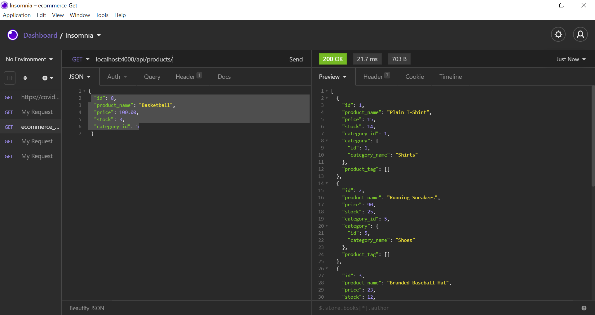

# E-Commerce Back End App ORM (object relational mapping)

## Description

This app

IThis app uses and node and express.js API with Sequelize to sync with a mySQL database.  It is the backend CLI app structure with all the API routes and calls for an ecommerce store.

Your task is to build the back end for an e-commerce site by modifying starter code. You’ll configure a working Express.js API to use Sequelize to interact with a MySQL database.

## Screenshot of the App

### Walkthrough Video

a demo video of how this app works can be found in this repo:

\ecommerceBackEndApp\ecommerceBackEndApp.mp4

## GitHub repo:

* https://github.com/Kassandra14/ecommerceBackEndApp
